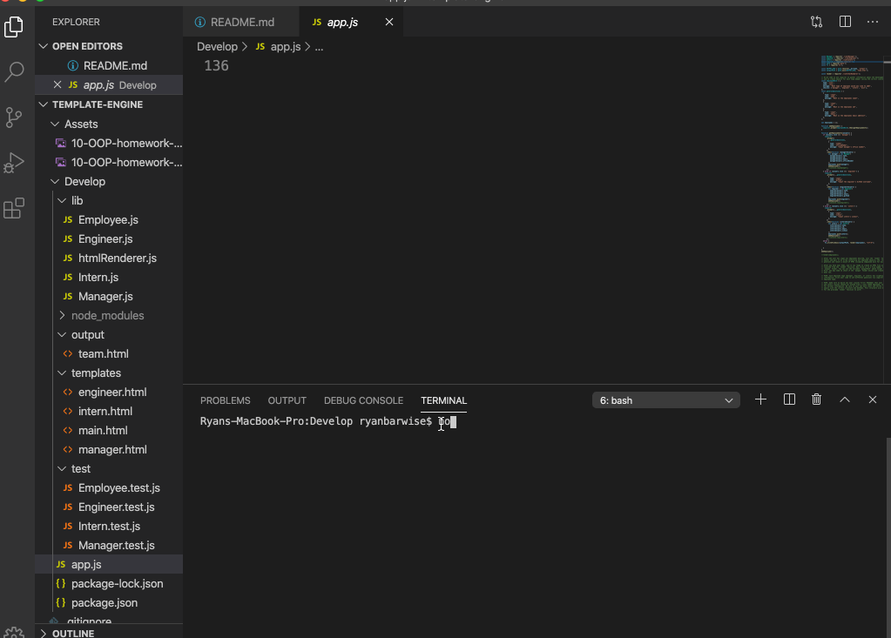

  
  # team-profile-generator
  
  
   

  ## Description
 the team-profile-generator uses a CLI which prompts a series of questions in order to create a webpage which will display basic information about employees

  ## Table of Contents
  1. [License](#license)
  2. [Installing Dependencies](#dependencies)
  3. [Tests](#tests)
  3. [Repo](#repo)
  4. [Contributions](#contributions)
  5. [Contact](#contact)

  
  ## License Information
     ISC

  
  ## Dependencies
     npm i

  
  ## Tests
   $ npm test

  
  ## Repo
  feel free to browse the repo use it as you see fit

  
  ## Contributions 
   send me an email

  
  ## Contact
  <ryanbarwise@gmail.com>
  
  
  

  
    
  
  